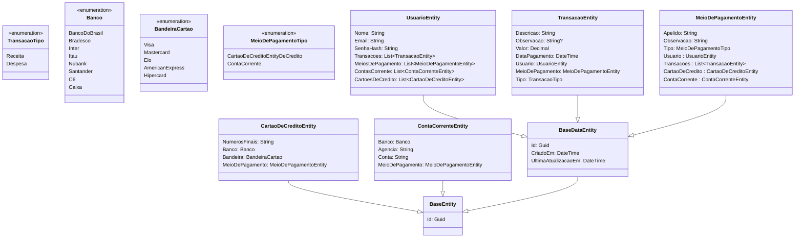
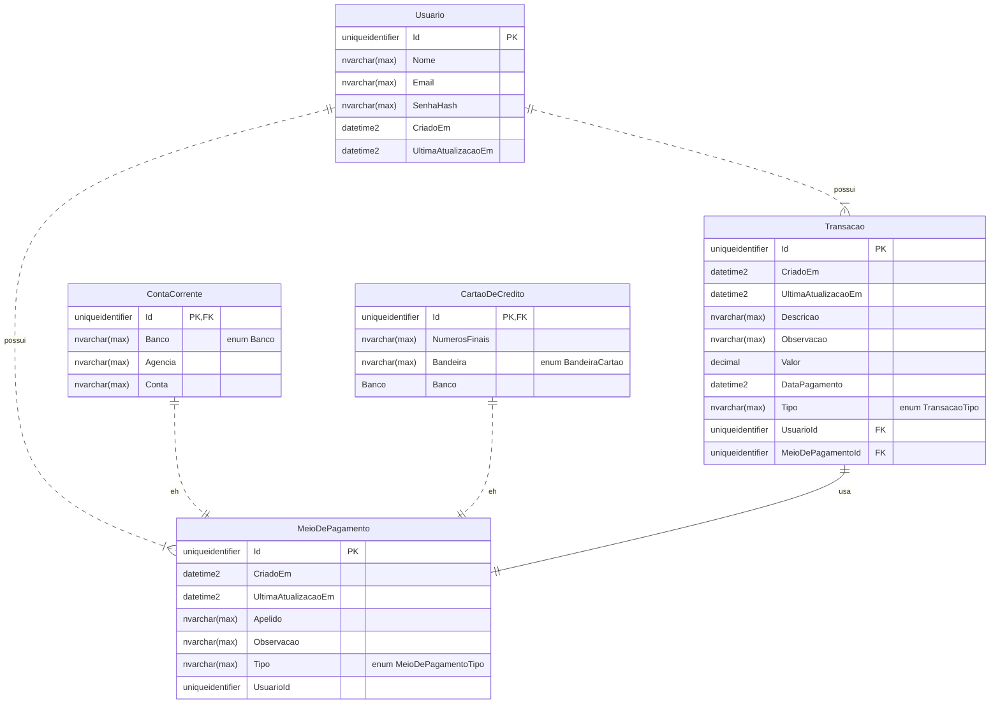

# MyCoreBanking

## Modelagem de dados dos objetos

<!-- Mermaid object relationships -->

```mermaid
classDiagram

class TransacaoTipo{
    <<enumeration>>
    Receita
    Despesa
}

class Banco{
    <<enumeration>>
    BancoDoBrasil
    Bradesco
    Inter
    Itau
    Nubank
    Santander
    C6
    Caixa
}

class BandeiraCartao{
    <<enumeration>>
    Visa
    Mastercard
    Elo
    AmericanExpress
    Hipercard
}

class MeioDePagamentoTipo{
    <<enumeration>>
    CartaoDeCreditoEntityDeCredito
    ContaCorrente
}

class BaseEntity{
    Id: Guid
}

class BaseDataEntity{
    Id: Guid
    CriadoEm: DateTime
    UltimaAtualizacaoEm: DateTime
}

class UsuarioEntity{
    Nome: String
    Email: String
    SenhaHash: String
    Transacoes: List~TransacaoEntity~
    MeiosDePagamento: List~MeioDePagamentoEntity~
    ContasCorrente: List~ContaCorrenteEntity~
    CartoesDeCredito: List~CartaoDeCreditoEntity~
}

class MeioDePagamentoEntity{
    Apelido: String
    Observacao: String
    Tipo: MeioDePagamentoTipo
    Usuario : UsuarioEntity
    Transacoes : List~TransacaoEntity~
    CartaoDeCredito : CartaoDeCreditoEntity
    ContaCorrente : ContaCorrenteEntity
}

class TransacaoEntity{
    Descricao: String
    Observacao: String?
    Valor: Decimal
    DataPagamento: DateTime
    Usuario: UsuarioEntity
    MeioDePagamento: MeioDePagamentoEntity
    Tipo: TransacaoTipo
}

class CartaoDeCreditoEntity{
    NumerosFinais: String
    Banco: Banco
    Bandeira: BandeiraCartao
    MeioDePagamento: MeioDePagamentoEntity
}

class ContaCorrenteEntity{
    Banco: Banco
    Agencia: String
    Conta: String
    MeioDePagamento: MeioDePagamentoEntity
}


%% Relacionamentos:
UsuarioEntity --|> BaseDataEntity
TransacaoEntity --|> BaseDataEntity
MeioDePagamentoEntity --|> BaseDataEntity
CartaoDeCreditoEntity --|> BaseEntity
ContaCorrenteEntity --|> BaseEntity
BaseDataEntity --|> BaseEntity
```

```mermaid
erDiagram

ContaCorrente{
    uniqueidentifier Id PK, FK
    nvarchar(max) Banco "enum Banco"
    nvarchar(max) Agencia
    nvarchar(max) Conta
}

MeioDePagamento{
    uniqueidentifier Id PK
    datetime2 CriadoEm
    datetime2 UltimaAtualizacaoEm
    nvarchar(max) Apelido
    nvarchar(max) Observacao
    nvarchar(max) Tipo "enum MeioDePagamentoTipo"
    uniqueidentifier UsuarioId
}

CartaoDeCredito{
    uniqueidentifier Id PK, FK
    nvarchar(max) NumerosFinais
    nvarchar(max) Bandeira "enum BandeiraCartao"
    Banco Banco
}

Usuario{
    uniqueidentifier Id PK
    nvarchar(max) Nome
    nvarchar(max) Email
    nvarchar(max) SenhaHash
    datetime2 CriadoEm
    datetime2 UltimaAtualizacaoEm
}

Transacao{
    uniqueidentifier Id PK
    datetime2 CriadoEm
    datetime2 UltimaAtualizacaoEm
    nvarchar(max) Descricao
    nvarchar(max) Observacao
    decimal Valor
    datetime2 DataPagamento
    nvarchar(max) Tipo "enum TransacaoTipo"
    uniqueidentifier UsuarioId FK
    uniqueidentifier MeioDePagamentoId FK    
}

Usuario ||..|{ MeioDePagamento : possui
Usuario ||..|{ Transacao : possui
ContaCorrente ||..|| MeioDePagamento : eh
CartaoDeCredito ||..|| MeioDePagamento : eh
Transacao ||--|| MeioDePagamento : usa
```
