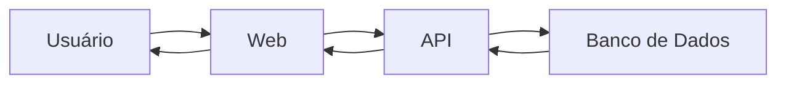
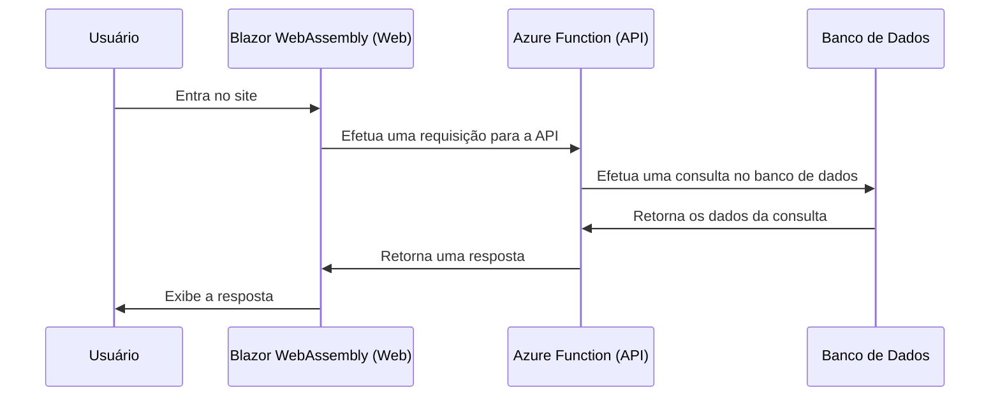
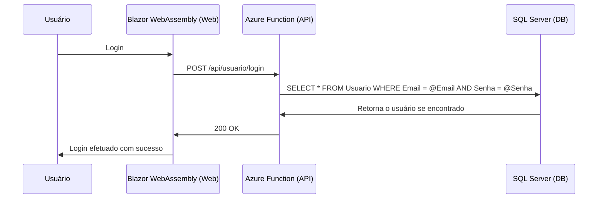
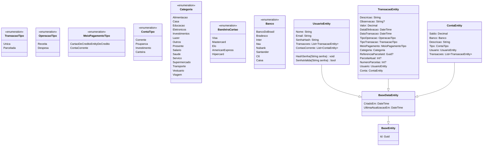
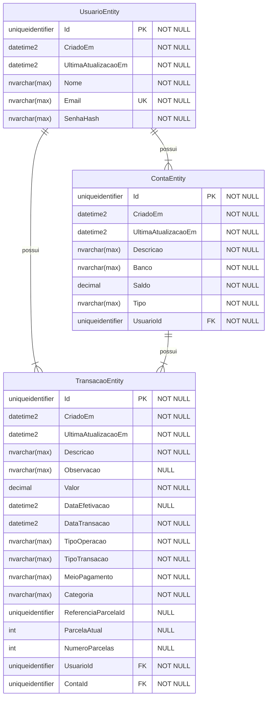

# MyCoreBanking

## Sobre

MyCoreBanking é um projeto pessoal para estudo de desenvolvimento de software. O objetivo é criar um sistema de controle financeiro pessoal, com funcionalidades básicas de um banco, como cadastro de contas, transações, acompanhamento das estatísticas por gráficos de movimentações, etc. O projeto foi desenvolvido utilizando o framework .NET 6.0, com a linguagem C#. O sistema foi dividido em duas partes: API e Web. A API foi desenvolvida utilizando Azure Functions e o banco de dados utilizado foi o SQL Server 2022. A Web foi desenvolvida utilizando Blazor WebAssembly.

---

## Versões

- v1:
  - Cadastro de usuários
  - Login
  - Cadastro de contas
  - Cadastro de transações
    - Únicas
    - Parcelamentos
  - Exportação de arquivo CSV
  - Gráficos de movimentações (receitas e despesas)
  - Gráficos de gastos por categoria (mensal e anual)
  - Saldo por conta (soma de todas as transações efetivadas da conta)
  - Saldo geral (soma de todos os saldos das contas)

- v2 (futuro):
  - Cartões de crédito
    - Cadastro de faturas
    - Efetivação de faturas
  - Planejamento
    - Possibilita criar metas de gastos onde o usuário pode definir um valor e uma data limite para atingir seu objetivo
    - O sistema deve calcular e notificar o usuário quando o valor disponível estiver chegando próximo ao valor estipulado para a meta
  - Transferências
    - Possibilita transferir transações entre contas
  - Investimentos
    - Ao selecionar o tipo de transação "Investimento", exibir um campo para selecionar a conta de origem e a conta de destino
    - O sistema deve descontar o saldo da conta de origem e adicionar o valor na conta de destino selecionada
    - A conta de destino deve ser do tipo "Investimento" ou "Poupança" e a conta de origem deve ser do tipo "Corrente" ou "Carteira"

---

## Pré-requisitos para rodar o projeto

- [.NET 6.0 SDK](https://dotnet.microsoft.com/download/dotnet/6.0)
- [Azure Functions Core Tools](https://docs.microsoft.com/pt-br/azure/azure-functions/functions-run-local?tabs=windows%2Ccsharp%2Cbash#v2)
- [EF Core Tools](https://docs.microsoft.com/pt-br/ef/core/cli/dotnet)
- [SQL Server 2022](https://www.microsoft.com/pt-br/sql-server/sql-server-downloads)
- Escolha uma [IDE](https://pt.wikipedia.org/wiki/Ambiente_de_desenvolvimento_integrado) de sua preferência:
  - [Visual Studio](https://visualstudio.microsoft.com/pt-br/downloads/)
  - [Visual Studio Code](https://code.visualstudio.com/)
    - [C#](https://marketplace.visualstudio.com/items?itemName=ms-dotnettools.csharp)
    - [Azure Functions](https://marketplace.visualstudio.com/items?itemName=ms-azuretools.vscode-azurefunctions)
    - [Azurite](https://marketplace.visualstudio.com/items?itemName=Azurite.azurite)
- [Azure Data Studio (opcional: SGBD)](https://docs.microsoft.com/pt-br/sql/azure-data-studio/download-azure-data-studio?view=sql-server-ver15)
- [Postman (opcional: testar requisições)](https://www.postman.com/downloads/)

Caso opte por utilizar o Visual Studio Code, é necessário instalar as extensões citadas acima. Para instalar as extensões, basta clicar no ícone de extensões no canto esquerdo da IDE e pesquisar pelo nome da extensão.

---

## [Como rodar o projeto ?](/docs/tutorial/README.md)

---

## Tecnologias utilizadas

- Framework: .NET 6.0
- API: Azure Functions 4.0
- Web: Blazor WebAssembly
- ORM: Entity Framework Core 6.0
- Database: SQL Server 2022

---

## Bibliotecas utilizadas

### Comuns (Shared)

- [CsvHelper](https://joshclose.github.io/CsvHelper/) - Manipulação de arquivos CSV
- [FluentValidation](https://fluentvalidation.net/) - Validação de dados

### Back-end

- [BCrypt.Net](https://github.com/BcryptNet/bcrypt.net) - Criptografia de senhas
- [JWT](https://jwt.io/) - Autenticação via token

### Front-end

- [Blazored.FluentValidation](https://github.com/Blazored/FluentValidation) - Validação de dados nos formulários do Blazor
- [Blazored.Toast](https://github.com/Blazored/Toast) - Notificações
- [Blazored.Modal](https://github.com/Blazored/Modal) - Modal
- [Blazored.SessionStorage](https://github.com/Blazored/SessionStorage) - Armazenamento de dados na sessão do navegador
- [ChartJs.Blazor](https://github.com/mariusmuntean/ChartJs.Blazor) - Gráficos

---

## Funcionalidades

### Usuário

- [x] Cadastro
- [x] Login
- [x] Ver perfil
- [x] Alteração

### Contas

- [x] Cadastro
  - [x] Regra de negócio: Limite máximo de 05 contas por usuário
- [x] Listagem
- [x] Obter por Id
- [x] Alteração
- [x] Exclusão
  - [x] Regra de negócio: Limite mínimo de 01 conta por usuário
  - [x] Regra de negócio: Não é possível excluir uma conta que possui transações associadas

### Transações

- [x] Cadastro
  - [x] Transação única
  - [x] Parcelamentos
- [x] Listagem
  - [x] Listagem por mês e ano
  - [x] Listagem por parcelamentoId -> (visualizar todas as parcelas de uma transação parcelada)
  - [x] Listagem por meio de pagamento (enum) -> (visualizar somente transações PIX, por exemplo)
  - [x] Listagem por tipo de operação (enum) -> (receita, despesa)
  - [x] Listagem por tipo de transação (enum) -> (única, parcelada)
  - [x] Listagem por categoria (enum) -> (alimentação, transporte, etc)
  - [x] Listagem por data de efetivação -> (visualizar transações efetivadas de um dia específico)
- [x] Obter por Id
- [x] Alteração
  - [x] Alteração de transação única
  - [x] Alteração de transação parcelada
    - [x] Alteração de parcela única (por id)
    - [x] Alteração de parcelas pendente de pagamento
    - [x] Alteração de todas as parcelas
- [x] Exclusão
  - [x] Exclusão de transação única
  - [x] Exclusão de transação parcelada
    - [x] Excluir parcela única (por id)
    - [x] Excluir todas as parcelas
- [x] Efetivação de transações
- [x] Exportação de arquivo CSV

### Estatísticas financeiras

- [x] Saldo total (soma do saldo das contas: corrente e carteira)
- [x] Total investido (soma do saldo das contas: investimento, poupança)
- [x] Número de transações pendentes
- [x] Balanço mensal (todas as contas)
- [x] Visão geral de movimentações -> obter valor total de receitas e despesas por mês (ano atual)
- [x] Total Despesas por categoria (mês atual)
- [x] Total Despesas por categoria (ano atual)

---

## Arquitetura

### Shared

O projeto Shared é responsável por conter as classes que são compartilhadas entre os projetos de domínio, API e cliente.

### Cliente

O cliente é uma aplicação Blazor WebAssembly, que  é responsável por exibir as informações para o usuário e enviar as requisições para a API.

### API

A API é uma Azure Function, que utiliza o padrão REST para expor os endpoints. É responsável por receber as requisições do cliente, validar os dados e chamar os serviços de domínio. Os serviços de domínio são responsáveis por realizar as regras de negócio e persistir os dados no banco de dados.

---

## Diagrama de contexto

<!-- Mermaid context diagram -->

---

## Diagrama de sequência

<!-- Mermaid sequence diagram -->

## Exemplo diagrama de sequência no fluxo de login

<!-- Mermaid sequence diagram -->

---

## Diagrama de classe

<!-- Mermaid object relationships -->

---

## Diagrama entidade-relacionamento

