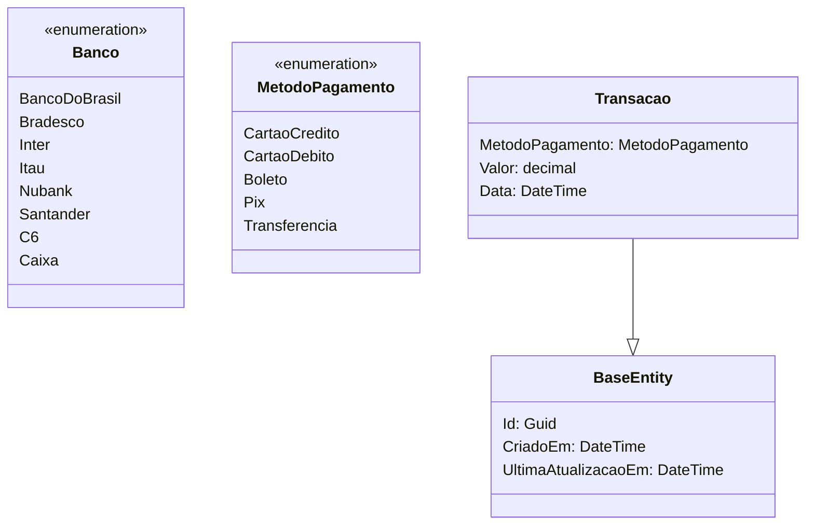

# MyCoreBanking

<!-- Mermaid object relationships -->

```mermaid
classDiagram

class Banco{
    <<enumeration>>
    BancoDoBrasil
    Bradesco
    Inter
    Itau
    Nubank
    Santander
    C6
    Caixa
}

class MetodoPagamento{
%% This whole line is a comment classDiagram class Shape <<interface>>
    <<enumeration>>
    CartaoCredito
    CartaoDebito
    Boleto
    Pix
    Transferencia
}

class BaseEntity{
    Id: Guid
    CriadoEm: DateTime
    UltimaAtualizacaoEm: DateTime
}

class Transacao{
    MetodoPagamento: MetodoPagamento
    Valor: decimal
    Data: DateTime
}

Transacao --|> BaseEntity

```
