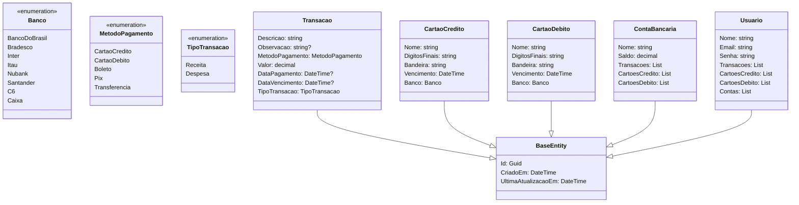

# MyCoreBanking

<!-- Mermaid object relationships -->

```mermaid
classDiagram

class Banco{
    <<enumeration>>
    BancoDoBrasil
    Bradesco
    Inter
    Itau
    Nubank
    Santander
    C6
    Caixa
}

class MetodoPagamento{
    <<enumeration>>
    CartaoCredito
    CartaoDebito
    Boleto
    Pix
    Transferencia
}

class TipoTransacao{
    <<enumeration>>
    Receita
    Despesa
}

class BaseEntity{
    Id: Guid
    CriadoEm: DateTime
    UltimaAtualizacaoEm: DateTime
}

class Transacao{
    Descricao: string
    Observacao: string?
    MetodoPagamento: MetodoPagamento
    Valor: decimal
    DataPagamento: DateTime?
    DataVencimento: DateTime?
    TipoTransacao: TipoTransacao
}

class CartaoCredito{
    Nome: string
    DigitosFinais: string
    Bandeira: string
    Vencimento: DateTime
    Banco: Banco
}

class CartaoDebito{
    Nome: string
    DigitosFinais: string
    Bandeira: string
    Vencimento: DateTime
    Banco: Banco
}

class ContaBancaria{
    Nome: string
    Saldo: decimal
    Transacoes: List<Transacao>
    CartoesCredito: List<CartaoCredito>
    CartoesDebito: List<CartaoDebito>
}

class Usuario{
    Nome: string
    Email: string
    Senha: string
    Transacoes: List<Transacao>
    CartoesCredito: List<CartaoCredito>
    CartoesDebito: List<CartaoDebito>
    Contas: List<ContaBancaria>
}

%% Relacionamentos:
Transacao --|> BaseEntity
CartaoCredito --|> BaseEntity
CartaoDebito --|> BaseEntity
ContaBancaria --|> BaseEntity
Usuario --|> BaseEntity
```
