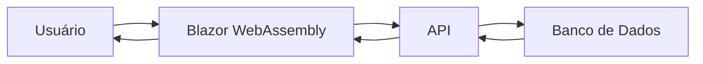
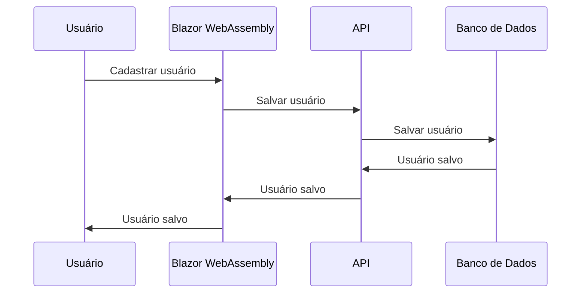
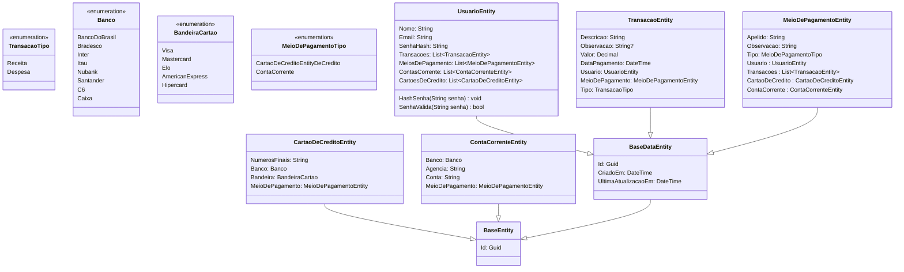

# MyCoreBanking

## ToDO:

- [ ] Criar algum endpoint com 402

## Sobre

MyCoreBanking é um projeto pessoal para estudo de desenvolvimento de software. O objetivo é criar um sistema de controle financeiro pessoal, com funcionalidades básicas de um banco, como cadastro de contas correntes, cartões de crédito, transações, etc.

## Tecnologias

- Framework: .NET 6.0
- API: Azure Functions 4.0
- Web: Blazor WebAssembly
- ORM: Entity Framework Core 6.0
- DB: SQL Server 2022

## Funcionalidades

- [ ] Usuário
  - [x] Cadastro
  - [x] Login
  - [ ] Logout
  - [ ] Alterar senha
  - [ ] Recuperar senha
  - [ ] Alterar dados

- [ ] Transações
  - [x] Cadastro
  - [x] Listagem
    - [ ] Listagem por período
  - [ ] Obter por Id
  - [ ] Alteração
  - [ ] Exclusão

- [ ] Contas correntes
  - [x] Cadastro
  - [x] Listagem
    - [ ] Listagem por período
    - [ ] Listagem por banco
  - [ ] Obter por Id
  - [ ] Alteração
  - [ ] Exclusão

- [ ] Cartões de crédito
  - [x] Cadastro
  - [x] Listagem
    - [ ] Listagem por período
    - [ ] Listagem por bandeira
    - [ ] Listagem por banco
  - [ ] Obter por Id
  - [ ] Alteração
  - [ ] Exclusão

<!-- ## Arquitetura

### API

A API é uma Azure Function, que utiliza o padrões REST 

A API é uma Azure Function, que utiliza o padrão de arquitetura de software DDD (Domain Driven Design). A API é responsável por receber as requisições do cliente, validar os dados e chamar os serviços de domínio. Os serviços de domínio são responsáveis por realizar as regras de negócio e persistir os dados no banco de dados.

### Banco de dados

O banco de dados é um SQL Server 2022, que utiliza o Entity Framework Core para mapear as entidades do domínio para tabelas do banco de dados.

### Cliente

O cliente é uma aplicação Blazor WebAssembly, que utiliza o padrão de arquitetura de software MVVM (Model-View-ViewModel). O cliente é responsável por exibir as informações para o usuário e enviar as requisições para a API. -->

## Diagrama de contexto

<!-- Mermaid context diagram -->

## Diagrama de sequência

<!-- Mermaid sequence diagram -->

## Diagrama de classe

<!-- Mermaid object relationships -->

## Diagrama entidade-relacionamento

