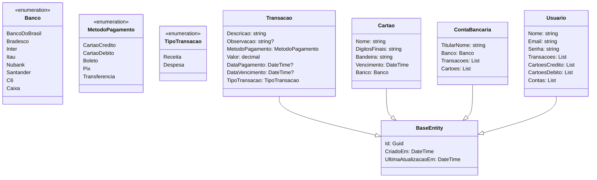
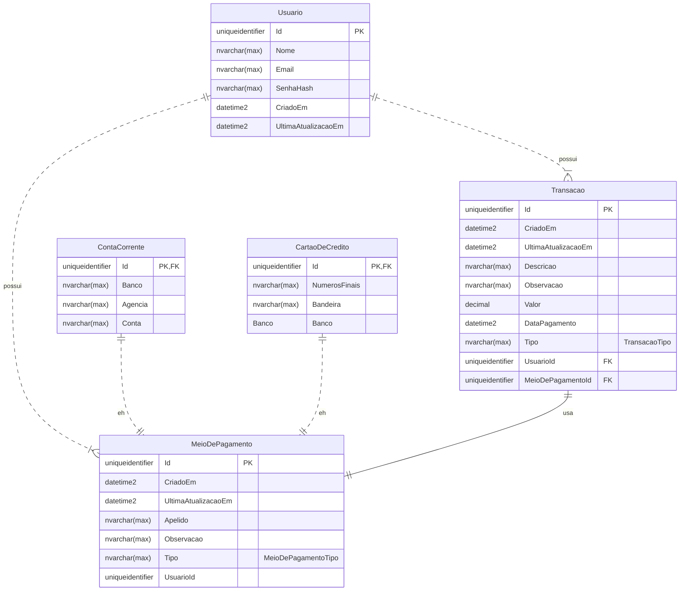

# MyCoreBanking

<!-- Mermaid object relationships -->

```mermaid
classDiagram

class Banco{
    <<enumeration>>
    BancoDoBrasil
    Bradesco
    Inter
    Itau
    Nubank
    Santander
    C6
    Caixa
}

class MetodoPagamento{
    <<enumeration>>
    CartaoCredito
    CartaoDebito
    Boleto
    Pix
    Transferencia
}

class TipoTransacao{
    <<enumeration>>
    Receita
    Despesa
}

class BaseEntity{
    Id: Guid
    CriadoEm: DateTime
    UltimaAtualizacaoEm: DateTime
}

class Transacao{
    Descricao: string
    Observacao: string?
    MetodoPagamento: MetodoPagamento
    Valor: decimal
    DataPagamento: DateTime?
    DataVencimento: DateTime?
    TipoTransacao: TipoTransacao
}

class Cartao{
    Nome: string
    DigitosFinais: string
    Bandeira: string
    Vencimento: DateTime
    Banco: Banco
}

class ContaBancaria{
    TitularNome: string
    Banco: Banco
    Transacoes: List<Transacao>
    Cartoes: List<Cartao>
}

class Usuario{
    Nome: string
    Email: string
    Senha: string
    Transacoes: List<Transacao>
    CartoesCredito: List<CartaoCredito>
    CartoesDebito: List<CartaoDebito>
    Contas: List<ContaBancaria>
}

%% Relacionamentos:
Transacao --|> BaseEntity
Cartao --|> BaseEntity
ContaBancaria --|> BaseEntity
Usuario --|> BaseEntity
```

```mermaid
erDiagram

ContaCorrente{
    uniqueidentifier Id PK, FK
    nvarchar(max) Banco
    nvarchar(max) Agencia
    nvarchar(max) Conta
}

MeioDePagamento{
    uniqueidentifier Id PK
    datetime2 CriadoEm
    datetime2 UltimaAtualizacaoEm
    nvarchar(max) Apelido
    nvarchar(max) Observacao
    nvarchar(max) Tipo "MeioDePagamentoTipo"
    uniqueidentifier UsuarioId
}

CartaoDeCredito{
    uniqueidentifier Id PK, FK
    nvarchar(max) NumerosFinais
    nvarchar(max) Bandeira
    Banco Banco
}

Usuario{
    uniqueidentifier Id PK
    nvarchar(max) Nome
    nvarchar(max) Email
    nvarchar(max) SenhaHash
    datetime2 CriadoEm
    datetime2 UltimaAtualizacaoEm
}

Transacao{
    uniqueidentifier Id PK
    datetime2 CriadoEm
    datetime2 UltimaAtualizacaoEm
    nvarchar(max) Descricao
    nvarchar(max) Observacao
    decimal Valor
    datetime2 DataPagamento
    nvarchar(max) Tipo "TransacaoTipo"
    uniqueidentifier UsuarioId FK
    uniqueidentifier MeioDePagamentoId FK    
}

Usuario ||..|{ MeioDePagamento : possui
Usuario ||..|{ Transacao : possui
ContaCorrente ||..|| MeioDePagamento : eh
CartaoDeCredito ||..|| MeioDePagamento : eh
Transacao ||--|| MeioDePagamento : usa
```
