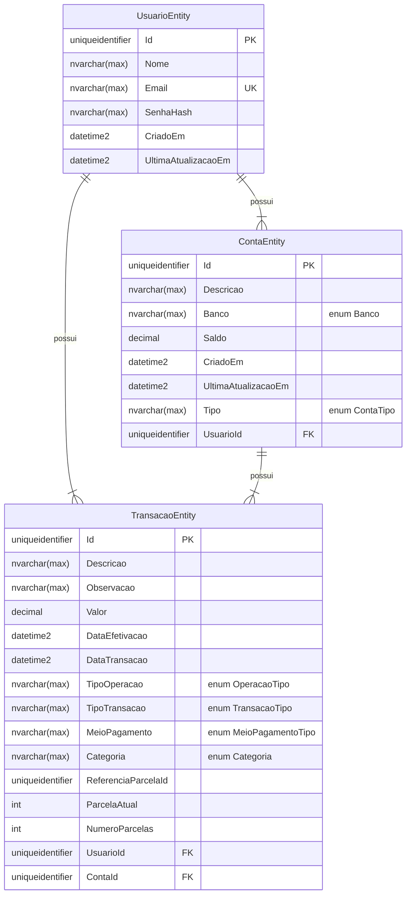

# MyCoreBanking

## TODO

- [x] Gráficos
- [x] Filtros para transações
- [ ] Importação de arquivo CSV
- [x] Alterar o diagrama de classe
- [x] Alterar o diagrama entidade-relacionamento

## Sobre

MyCoreBanking é um projeto pessoal para estudo de desenvolvimento de software. O objetivo é criar um sistema de controle financeiro pessoal, com funcionalidades básicas de um banco, como cadastro de contas correntes, cartões de crédito, transações, etc.

## Versões

- v1:
  - Cadastro de usuários
  - Login
  - Cadastro de contas
  - Cadastro de transações
    - Únicas
    - Parcelamentos
    - Importação de arquivo CSV
  - Gráficos de gastos e receitas
  - Gráficos de gastos e receitas por categoria
  - Gráficos de gastos e receitas por conta
  - Gráficos de gastos e receitas por mês
  - Saldos por conta (soma de todas as transações efetivadas da conta)
  - Saldo geral (soma de todos os saldos das contas)

- v2 (futuro):
  - Cartões de crédito
    - Cadastro de faturas
    - Efetivação de faturas
  - Transferências
    - Ao selecionar o tipo de transação "Transferência", o sistema deve exibir as contas disponíveis para o usuário e permitir que ele selecione a conta de destino
  - Investimentos
    - Ao selecionar o tipo de transação "Investimento", o sistema deve descontar o saldo da conta de origem e adicionar o valor na conta de destino selecionada

## Tecnologias

- Framework: .NET 6.0
- API: Azure Functions 4.0
- Web: Blazor WebAssembly
- ORM: Entity Framework Core 6.0
- Database: SQL Server 2022

## Pré-requisitos

- [.NET 6.0 SDK](https://dotnet.microsoft.com/download/dotnet/6.0)
- [Azure Functions Core Tools](https://docs.microsoft.com/pt-br/azure/azure-functions/functions-run-local?tabs=windows%2Ccsharp%2Cbash#v2)
- [EF Core Tools](https://docs.microsoft.com/pt-br/ef/core/cli/dotnet)
- [SQL Server 2022](https://www.microsoft.com/pt-br/sql-server/sql-server-downloads)
- [Visual Studio Code](https://code.visualstudio.com/)
  - [C#](https://marketplace.visualstudio.com/items?itemName=ms-dotnettools.csharp)
  - [Azure Functions](https://marketplace.visualstudio.com/items?itemName=ms-azuretools.vscode-azurefunctions)
  - [Azurite](https://marketplace.visualstudio.com/items?itemName=Azurite.azurite)
- [Azure Data Studio (opcional: SGBD)](https://docs.microsoft.com/pt-br/sql/azure-data-studio/download-azure-data-studio?view=sql-server-ver15)
- [Postman (opcional: testar requisições)](https://www.postman.com/downloads/)

## Funcionalidades

### Usuário

- [x] Cadastro
- [x] Login
- [x] Ver perfil
- [x] Alteração

### Contas

- [x] Cadastro
  - [x] Regra de negócio: Limite máximo de 05 contas por usuário
- [x] Listagem
- [x] Obter por Id
- [x] Alteração
- [x] Exclusão
  - [x] Regra de negócio: Limite mínimo de 01 conta por usuário
  - [x] Regra de negócio: Não é possível excluir uma conta que possui transações associadas

### Transações

- [x] Cadastro
  - [x] Transação única
  - [x] Parcelamentos
  - [ ] Importação de arquivo CSV
- [x] Listagem
  - [x] Listagem por mês e ano
  - [x] Listagem por parcelamentoId -> (visualizar todas as parcelas de uma transação parcelada)
  - [x] Listagem por meio de pagamento (enum) -> (visualizar somente transações PIX, por exemplo)
  - [x] Listagem por tipo de operação (enum) -> (receita, despesa)
  - [x] Listagem por tipo de transação (enum) -> (única, parcelada)
  - [x] Listagem por categoria (enum) -> (alimentação, transporte, etc)
  - [x] Listagem por período de pagamentos efetivados -> (data inicial e/ou data final)
- [x] Obter por Id
- [x] Alteração
  - [x] Alteração de transação única
  - [x] Alteração de transação parcelada
    - [x] Alteração de parcela única (por id)
    - [x] Alteração de parcelas pendente de pagamento
    - [x] Alteração de todas as parcelas
- [x] Exclusão
  - [x] Exclusão de transação única
  - [x] Exclusão de transação parcelada
    - [x] Excluir parcela única (por id)
    - [x] Excluir todas as parcelas
- [x] Efetivação de transações

### Estatísticas financeiras

- [x] Saldo total (soma do saldo das contas: corrente e carteira)
- [x] Total investido (soma do saldo das contas: investimento, poupança)
- [x] Número de transações pendentes (mês atual)
- [x] Balanço mensal (todas as contas)
- [x] Total Despesas por categoria (mês atual)
- [x] Visão geral de receitas e despesas -> obter valor total de receitas e despesas por mês (ano atual)

## Arquitetura

### Cliente

O cliente é uma aplicação Blazor WebAssembly, que  é responsável por exibir as informações para o usuário e enviar as requisições para a API.

### API

A API é uma Azure Function, que utiliza o padrão REST para expor os endpoints. É responsável por receber as requisições do cliente, validar os dados e chamar os serviços de domínio. Os serviços de domínio são responsáveis por realizar as regras de negócio e persistir os dados no banco de dados.

### Banco de dados

O banco de dados é um SQL Server 2022, que utiliza o Entity Framework Core para mapear as entidades do domínio para tabelas do banco de dados. O banco de dados é responsável por armazenar os dados da aplicação.

## Diagrama de contexto

<!-- Mermaid context diagram -->

## Diagrama de sequência

<!-- Mermaid sequence diagram -->

## Diagrama de classe

<!-- Mermaid object relationships -->

## Diagrama entidade-relacionamento

